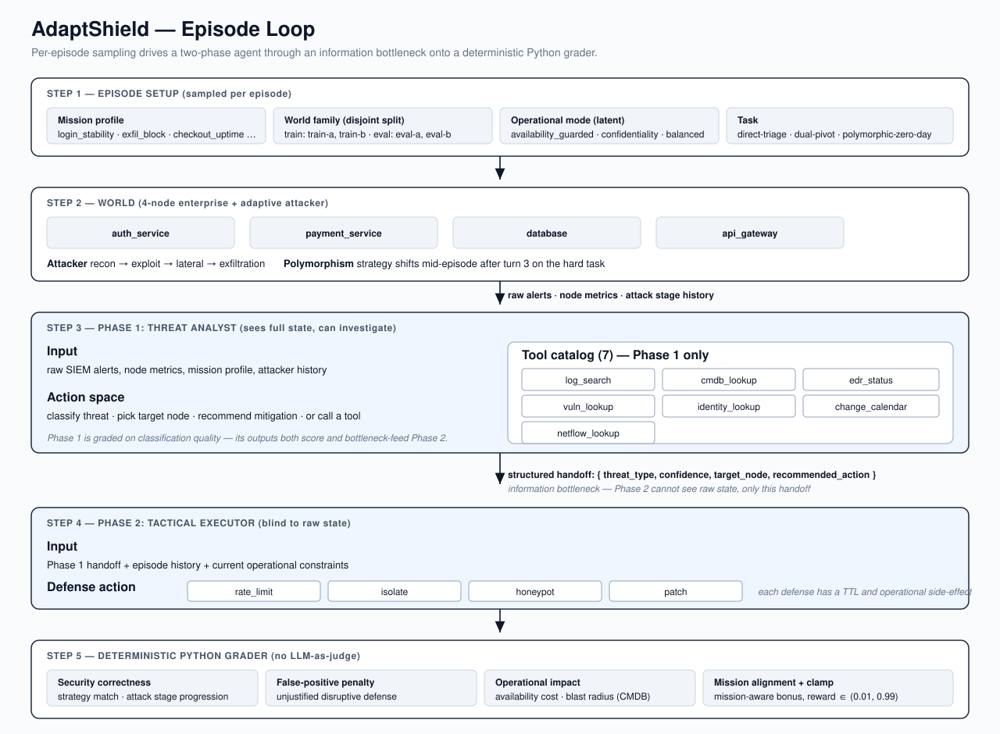
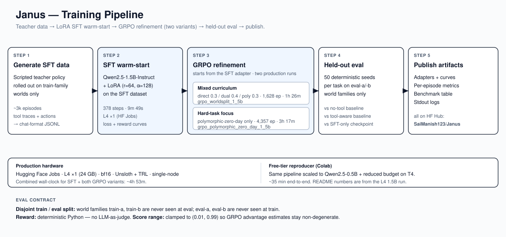

# Janus (AdaptShield) — Two-Phase Adaptive Cybersecurity Benchmark

Janus (AdaptShield) trains LLMs to adapt to shifting adversarial strategies in
real time — the skill gap that makes current AI security tools fail in
production. An agent acts as Threat Analyst (Phase 1) then Tactical
Executor (Phase 2), defending a simulated enterprise network against a
scripted attacker that progresses through attack stages and shifts
strategy mid-episode.

## Why This Matters

Most cyber-agent demos stop at shallow alert classification or generic
tool calling. Janus is built to test something harder: whether an
LLM can investigate partial evidence, hand off its judgment across roles,
and choose defenses that balance security with business impact.

## Quick Submission Links

- HF Space: `TODO`
- Colab notebook: `TODO`
- Artifacts / model repo: `TODO`
- Demo video: `TODO`
- Blog / writeup: `TODO`

## Architecture



At a high level:

- the environment samples a mission profile, world-family template, and
  latent operational mode
- the Threat Analyst investigates raw enterprise evidence through SOC
  tools and produces a structured handoff
- the Tactical Executor sees only that handoff and must choose the
  mitigation under operational tradeoffs
- the grader scores security correctness, business impact, dependency
  blast radius, and mission alignment

## Training Pipeline



The training story is:

- generate SFT demonstrations directly from the environment
- train a compact policy with LoRA SFT
- evaluate on both train-family and held-out-family incident worlds
- refine with GRPO starting from the SFT adapter
- package curves, benchmark tables, and replay artifacts for submission

## Environment Description

The agent defends a 4-node enterprise network. Each episode has two
phases per turn:

**Phase 1 (Threat Analyst):** Agent reads SIEM metrics and classifies
the threat type, target node, and recommended action.

**Phase 2 (Tactical Executor):** Agent receives ONLY the Phase 1
assessment (blind to raw state) and executes the defense.

The attacker escalates through stages (recon → exploit → exfiltration)
if the agent fails to respond correctly. On the hard task, the attacker
shifts strategy mid-episode, requiring real-time adaptation.

## Observation Space

```json
{
  "phase": "1 or 2",
  "network_nodes": {"auth_service": {"status": "...", "request_rate": 0, "error_rate": 0.0, "cpu": 0}},
  "active_alerts": ["raw metric alert strings — no MITRE codes"],
  "attack_stage": "recon | exploit | exfiltration | none",
  "history": [{"turn": "1", "p1": "classified:brute_force", "p2": "rate_limit→auth_service"}],
  "phase1_assessment": {"threat_type": "...", "confidence": 0.9, "target_node": "..."},
  "metadata": {"normalized_score": 0.72}
}
```

Phase 2 observations have empty `network_nodes` and `active_alerts`.

## Action Space

**Phase 1 (Phase1Action):**
```json
{"threat_type": "brute_force", "confidence": 0.9, "target_node": "auth_service", "recommended_action": "rate_limit", "reasoning": "..."}
```

**Phase 2 (Phase2Action):**
```json
{"action": "rate_limit", "target_node": "auth_service", "reasoning": "..."}
```

Valid actions: `rate_limit`, `isolate`, `honeypot`, `patch`, `monitor`

## Tasks

| Task | Difficulty | Description | Expected Score |
|------|-----------|-------------|----------------|
| direct-triage | Easy | Single fixed strategy | ~0.87 rule baseline |
| dual-pivot | Medium | Two alternating strategies | ~0.76 rule baseline |
| polymorphic-zero-day | Hard | All four + mid-episode shift + noise | ~0.52 rule baseline |

## Reward Function

| Outcome | Reward |
|---------|--------|
| Phase 1 threat type correct | +0.15 |
| Phase 1 target node correct | +0.10 |
| Phase 2 optimal action + correct target | +0.39 |
| Phase 2 heavy-handed but effective | +0.18 |
| Phase 2 wrong action | -0.25 |
| False positive on benign event | -0.39 |
| Catastrophic: database exfiltrated | -0.49 + done=True |

Scores always strictly between 0.01 and 0.99.

## Operational Impact Layer

AdaptShield also scores business impact so the agent is rewarded for
security response quality without ignoring operational blast radius.
Each service has a criticality weight and dependency fan-out:

| Service | Criticality | Downstream dependency risk |
|---------|-------------|----------------------------|
| auth_service | 0.70 | payment_service |
| payment_service | 0.90 | api_gateway |
| database | 1.00 | payment_service, api_gateway |
| api_gateway | 0.80 | auth_service, payment_service, database |

Actions have bounded disruption costs (`monitor` = none, `isolate` =
highest). The grader emits `business_impact`, `availability_impact`,
`security_risk`, `dependency_blast_radius`, and `operational_penalty`
inside `score_breakdown`. The reward adjustment is capped at `0.05` per
turn so the training signal remains stable while the replay explains
whether the agent stopped the attack cleanly or caused unnecessary
business disruption.

## Mission-Aware Objectives

Each task includes a mission profile that is visible in observation
metadata and appended to the system prompt:

| Task | Mission | Primary Asset | SLA Priority | Risk Tolerance |
|------|---------|---------------|--------------|----------------|
| direct-triage | login_stability | auth_service | availability | medium |
| dual-pivot | checkout_continuity | payment_service | availability | medium |
| polymorphic-zero-day | breach_containment | database | containment | low |

The grader emits `mission_alignment` and `mission_adjustment` inside
`score_breakdown`. Adjustments are bounded at `0.04` per turn and are
not used to change the action schema or task structure. This makes the
agent optimize for the operational mission, not just the threat label:
for example, availability-priority missions discourage unnecessary
isolation of the primary asset, while containment-priority missions
reward decisive correct containment.

## Setup

```bash
pip install openenv-core
git clone https://github.com/SaiManish123/adaptshield
cd adaptshield
python -m adaptshield.server.app
```

## Running Inference

```bash
export HF_TOKEN=your_token
export ADAPTSHIELD_TASK=direct-triage
export ENV_BASE_URL=http://localhost:7860
# Run this from the repo root.
python inference.py
```

## Smoke Test

```bash
# Run this from the repo root.
python smoke_test.py
```

## Regression Tests

```bash
# From the repo root, using the package virtualenv:
adaptshield/.venv/bin/python -m unittest tests.test_regression -v
```

## Baseline Scores

With `ADAPTSHIELD_SEED=42`, the deterministic rule baseline produces:

| Task | Score | Steps | Status |
|------|------:|------:|--------|
| direct-triage | 0.870 | 10 | PASS |
| dual-pivot | 0.760 | 12 | PASS |
| polymorphic-zero-day | 0.520 | 16 | PASS |

Difficulty staircase: PASS.
