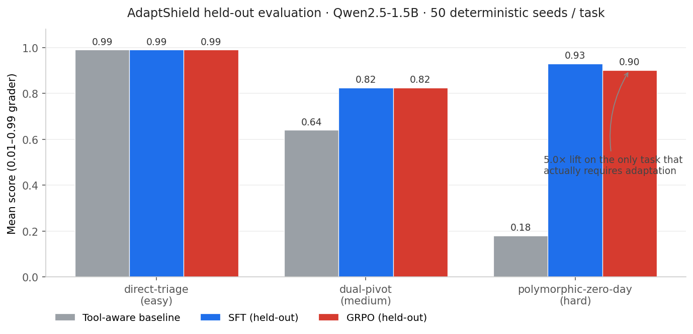

# Janus (AdaptShield) — Two-Phase Adaptive Cybersecurity Benchmark

**AdaptShield** is the environment: a two-phase agentic cybersecurity
simulator where an LLM defends a 4-node enterprise network against an
adversary that shifts strategy mid-episode. **Janus** is the model we
trained on it — a Qwen2.5-1.5B LoRA, supervised then refined with GRPO.
On the hardest task Janus scores 0.90 on a held-out world family it
never saw during training; a tool-aware heuristic baseline scores 0.18
on the same task.

The skill being tested is narrow on purpose. Not threat classification.
Not generic tool calling. The benchmark targets one thing: real-time
adaptation when the attacker's playbook changes mid-incident. Section
[Why this matters](#why-this-matters) explains why we think that's the
gap, and the [Results](#results) section is where the gap closes.

## Project Links

- **HF Space (live env):** [`SaiManish123/adaptshield`](https://huggingface.co/spaces/SaiManish123/adaptshield)
- **Colab notebook (SFT + GRPO reproducer, free T4):** `TODO`
- **Artifacts / model repo:** [`SaiManish123/Janus`](https://huggingface.co/SaiManish123/Janus)
- **Demo video:** `TODO`

---

## Why this matters

Most cyber-agent demos test threat classification or generic tool
calling. Real production breaches don't look like that. They look like
this:

In April 2026 attackers compromised Context.ai, used its OAuth
integration into a Vercel employee's Google Workspace, and pivoted from
shadow AI through identity into Vercel's internal systems, where they
enumerated and decrypted customer environment variables. The same week,
a Broken Object Level Authorization flaw in Lovable.dev let any
free-tier account read source code, Supabase credentials, Stripe keys
and AI chat histories from other tenants — including projects built by
AI itself. Eight months earlier, the Tea dating app left a Firebase
bucket open and 72,000 verification selfies and driver's licenses of
women on a safety app were scraped to 4chan within hours.

Three different failure modes — identity hijack via shadow AI, broken
authz in vibe-coded apps, classic cloud misconfig — but the same
underlying problem for the defender's agent. The environment is shifting
faster than any static training distribution can keep up with, and the
real attacker doesn't sit still while you classify them.

AdaptShield is built around that pressure. The environment forces the
agent to (1) act on partial evidence, (2) hand judgment across two
roles with an information bottleneck between them, (3) trade security
correctness against operational blast radius, and (4) re-plan when the
adversary's playbook changes mid-episode. Each of those is a separate
failure mode in production SOC tooling, and the benchmark scores all
four at once.

---

## Results

Numbers below come from the production run on Hugging Face L4 Jobs,
training Qwen2.5-1.5B-Instruct with a LoRA adapter. Eval is 50
deterministic seeds per task, evaluated on a held-out world family
the policy never saw during training.



On the hard task (`polymorphic-zero-day`) the tool-aware heuristic
baseline scores 0.18 and Janus holds 0.90 on the held-out family. On
the easier tasks the lift is smaller because the rule baseline is
already near the ceiling; the benchmark is shaped so adaptation only
matters where it should.

### Benchmark comparison (full table)

| Task | No-tool baseline | Tool-aware baseline | SFT (train family) | SFT (held-out) | GRPO (train) | GRPO (held-out) |
|------|-----------------:|-------------------:|-------------------:|---------------:|-------------:|----------------:|
| `direct-triage`        | 0.860 | 0.990 | 0.990 | 0.990 | 0.990 | 0.990 |
| `dual-pivot`           | 0.650 | 0.640 | 0.825 | 0.825 | 0.825 | 0.825 |
| `polymorphic-zero-day` | 0.380 | 0.180 | 0.960 | 0.930 | **0.883** | **0.902** |

Two things in this table are worth flagging.

The tool-aware baseline scores 0.18 on the hard task — worse than the
no-tool baseline at 0.38. That isn't a bug in the baseline; it's that
bolting tools onto a heuristic without learning when to trust them
makes the agent over-trigger on injected false positives. You see the
same pattern in production with rule-based SOAR playbooks against
adaptive adversaries.

Held-out GRPO (0.902) actually edges out train-family GRPO (0.883). That
is evidence the policy is generalizing across world templates rather
than memorizing them. Without splitting the eval by world family this
finding wouldn't be visible — same-seed evaluation would have credited
the model for memorization it didn't do.

### SFT — loss and held-out reward


### GRPO — refinement on the polymorphic adversary


### Training runs

Three production runs on Hugging Face Jobs produced the artifacts in this
README. Stdout logs are public and the per-step / per-episode metrics
files are next to the adapters.

| Run | Trainer | GPU | Steps / Episodes | Train wall-clock | Logs | Metrics |
|-----|---------|-----|------------------|------------------|------|---------|
| [`sft_worldsplit_1_5b`](https://huggingface.co/SaiManish123/Janus/tree/main/sft_worldsplit_1_5b) | SFT (LoRA) | L4 ×1 | 378 steps | 9m 49s | [stdout](https://huggingface.co/SaiManish123/Janus/blob/main/logs/sft_worldsplit_1_5b.log) | [trainer_state](https://huggingface.co/SaiManish123/Janus/blob/main/sft_worldsplit_1_5b/checkpoint-378/trainer_state.json) |
| [`grpo_worldsplit_1_5b`](https://huggingface.co/SaiManish123/Janus/tree/main/grpo_worldsplit_1_5b) | GRPO, mixed curriculum | L4 ×1 | 1,628 episodes | 1h 26m | [stdout](https://huggingface.co/SaiManish123/Janus/blob/main/logs/grpo_worldsplit_1_5b.log) | [per-episode](https://huggingface.co/SaiManish123/Janus/blob/main/grpo_worldsplit_1_5b/metrics.json) |
| [`grpo_polymorphic_zero_day_1_5b`](https://huggingface.co/SaiManish123/Janus/tree/main/grpo_polymorphic_zero_day_1_5b) | GRPO, hard-task focus | L4 ×1 | 4,357 episodes | 3h 17m | [stdout](https://huggingface.co/SaiManish123/Janus/blob/main/logs/grpo_polymorphic_zero_day_1_5b.log) | [per-episode](https://huggingface.co/SaiManish123/Janus/blob/main/grpo_polymorphic_zero_day_1_5b/metrics.json) |

The curriculum run mixes all three tasks (weights `direct-triage: 0.3 /
dual-pivot: 0.4 / polymorphic-zero-day: 0.3`). The polymorphic run
trains exclusively on the hard task to push hard-task performance
without distraction from saturated tiers. Per-episode reward in both
runs stabilizes within the first ~500 episodes and stays there for the
rest of the schedule.

---

## Architecture


Each episode runs against a sampled mission profile, world-family
template, and latent operational mode. The Threat Analyst investigates
raw enterprise evidence through SOC tools and emits a structured
handoff. The Tactical Executor sees only that handoff (not the raw
state) and chooses the mitigation. A deterministic Python grader scores
security correctness, business impact, dependency blast radius, and
mission alignment. There is no LLM-as-judge anywhere in the loop.

## Training Pipeline


Five steps, each reproducible from the repo:

1. Generate SFT demonstrations by rolling AdaptShield episodes with a
   rule-based Phase 1 expert and a tool-aware Phase 2 expert.
2. Train a LoRA adapter on Qwen2.5-1.5B (or 0.5B for the Colab
   reproducer) with supervised fine-tuning on those demos.
3. Evaluate on both train-family and held-out-family worlds. The split
   is by world template, not by seed, so memorizing a template doesn't
   transfer across the split.
4. Refine the SFT adapter with GRPO on a curriculum weighted toward
   `polymorphic-zero-day`. The deterministic grader is the reward.
5. Publish adapters, curves, metrics, and benchmark tables to
   [`SaiManish123/Janus`](https://huggingface.co/SaiManish123/Janus).

A free-tier Colab notebook reproduces steps 1–4 end-to-end on a T4 in
roughly 35 minutes using Qwen2.5-0.5B and reduced episode budgets. The
numbers in this README come from the 1.5B run on a Hugging Face L4 Job.

---

## Environment Description

The agent defends a 4-node enterprise network (`auth_service`,
`payment_service`, `database`, `api_gateway`). Each turn has two phases:

**Phase 1 — Threat Analyst.** Agent reads SIEM metrics, can call SOC tools
(log search, network telemetry, threat intel lookup), and emits a
structured `Phase1Action` with threat type, target node, confidence and a
recommended action.

**Phase 2 — Tactical Executor.** Agent receives only the Phase 1
assessment (blind to raw state) and emits a `Phase2Action`. The analyst
has to communicate clearly because the executor cannot double-check the
network.

The attacker escalates through `recon → exploit → exfiltration` if the
agent fails to respond correctly. On the hard task, the attacker shifts
strategy mid-episode and seeds false-positive noise that looks like a
real attack but isn't — punishing reflexive isolation.

### Observation Space

```json
{
  "phase": "1 or 2",
  "network_nodes": {
    "auth_service": {"status": "...", "request_rate": 0, "error_rate": 0.0, "cpu": 0}
  },
  "active_alerts": ["raw metric alert strings — no MITRE codes"],
  "attack_stage": "recon | exploit | exfiltration | none",
  "history": [{"turn": "1", "p1": "classified:brute_force", "p2": "rate_limit→auth_service"}],
  "phase1_assessment": {"threat_type": "...", "confidence": 0.9, "target_node": "..."},
  "metadata": {"normalized_score": 0.72}
}
```

Phase 2 observations have empty `network_nodes` and `active_alerts` — the
executor only sees the analyst's handoff.

### Action Space

**Phase 1 (`Phase1Action`):**
```json
{"threat_type": "brute_force", "confidence": 0.9, "target_node": "auth_service", "recommended_action": "rate_limit", "reasoning": "..."}
```

**Phase 2 (`Phase2Action`):**
```json
{"action": "rate_limit", "target_node": "auth_service", "reasoning": "..."}
```

Valid actions: `rate_limit`, `isolate`, `honeypot`, `patch`, `monitor`.

### Tasks

| Task | Difficulty | Description | Rule baseline |
|------|-----------|-------------|--------------:|
| `direct-triage` | Easy | Single fixed strategy | ~0.87 |
| `dual-pivot` | Medium | Two alternating strategies | ~0.76 |
| `polymorphic-zero-day` | Hard | All four + mid-episode shift + noise | ~0.52 |

### Reward Function

| Outcome | Reward |
|---------|-------:|
| Phase 1 threat type correct | +0.15 |
| Phase 1 target node correct | +0.10 |
| Phase 2 optimal action + correct target | +0.39 |
| Phase 2 heavy-handed but effective | +0.18 |
| Phase 2 wrong action | -0.25 |
| False positive on benign event | -0.39 |
| Catastrophic: database exfiltrated | -0.49, `done=True` |

Scores are clipped to the open interval `(0.01, 0.99)` — the grader never
emits exactly 0 or 1, which keeps GRPO advantages well-defined.

### Operational Impact Layer

AdaptShield also scores business impact, so the agent is rewarded for
stopping the attack without ignoring operational blast radius. Each
service has a criticality weight and a dependency fan-out:

| Service | Criticality | Downstream dependency risk |
|---------|------------:|----------------------------|
| `auth_service` | 0.70 | `payment_service` |
| `payment_service` | 0.90 | `api_gateway` |
| `database` | 1.00 | `payment_service`, `api_gateway` |
| `api_gateway` | 0.80 | `auth_service`, `payment_service`, `database` |

Actions have bounded disruption costs (`monitor` = none, `isolate` =
highest). The grader emits `business_impact`, `availability_impact`,
`security_risk`, `dependency_blast_radius`, and `operational_penalty`
inside `score_breakdown`. The reward adjustment is capped at `±0.05` per
turn, which keeps the training signal stable while leaving the replay
detailed enough to explain whether the agent stopped the attack cleanly
or caused unnecessary business disruption getting there.

### Mission-Aware Objectives

Each task carries a mission profile, visible in observation metadata and
appended to the system prompt:

| Task | Mission | Primary Asset | SLA Priority | Risk Tolerance |
|------|---------|---------------|--------------|----------------|
| `direct-triage` | `login_stability` | `auth_service` | availability | medium |
| `dual-pivot` | `checkout_continuity` | `payment_service` | availability | medium |
| `polymorphic-zero-day` | `breach_containment` | `database` | containment | low |

The grader emits `mission_alignment` and `mission_adjustment`, capped at
`±0.04` per turn. This makes the agent optimize for the operational
mission, not just the threat label. Availability-priority missions
discourage unnecessary isolation of the primary asset; containment
missions reward decisive correct containment of the crown-jewel
database.

### Design choices that aren't obvious

A few decisions in the environment that look like details but matter
for what the benchmark actually measures:

- **Information bottleneck between phases.** Phase 2's observation has
  empty `network_nodes` and `active_alerts`. The executor only sees
  Phase 1's structured handoff. If Phase 1 can't communicate clearly,
  Phase 2 fails — and you see it in the score, not in a separate metric.
  This is what makes the env actually test cross-role coordination
  rather than just two independent policies stitched together.
- **Train/eval split by world family, not by seed.** The world templates
  used for training are disjoint from the ones used for held-out
  evaluation. A model that overfits to a specific service-name pattern
  or a specific alert distribution will pass train evals and fail
  held-out. Same-seed evaluation would have hidden this.
- **Open scoring interval `(0.01, 0.99)`.** The grader never emits
  exactly 0 or 1. This keeps GRPO advantage estimates well-defined —
  saturating rewards collapse the variance the algorithm needs.
- **Bounded auxiliary signals.** Operational impact is capped at `±0.05`
  per turn and mission alignment at `±0.04`. They steer the policy
  without dominating the security signal, so the training curve doesn't
  get hijacked by a single side-objective.
- **Deterministic Python grader, no LLM-as-judge.** Rewards come from
  strategy matching against a fixed ground-truth attacker, not from a
  judge model. The benchmark cannot be gamed by a more eloquent policy.
- **Phase-1 alerts are raw metric strings, not MITRE codes.** The agent
  has to do the classification, not match a label to a label. This is
  what makes the soc-tool baseline collapse on the hard task: heuristic
  classification doesn't survive injected noise.

---

## Reproduce it

### Free-tier Colab (recommended for judges)

Open the Colab notebook linked above and run top-to-bottom. It will:

- install the exact pinned dependency stack used in the HF Job
- generate SFT demos from the environment
- train an SFT LoRA on Qwen2.5-0.5B (T4-friendly)
- run GRPO refinement on top of that SFT adapter
- print the benchmark table and inline the production training curves
  from `SaiManish123/Janus` so you can compare scaled-down vs. full runs

End-to-end runtime on a Colab T4 is roughly 35 minutes.

### Local setup

```bash
pip install openenv-core
git clone https://github.com/SaiManish123/adaptshield
cd adaptshield
python -m adaptshield.server.app
```

### Run inference against the live environment

```bash
export HF_TOKEN=your_token
export ADAPTSHIELD_TASK=direct-triage     # or dual-pivot / polymorphic-zero-day
export ENV_BASE_URL=http://localhost:7860
python inference.py                        # run from the repo root
```

`inference.py` honors the evaluator contract: `[START]`, `[STEP]`, `[END]`
stdout markers and credentials read only from environment variables.

### Smoke test

```bash
python smoke_test.py
```

Spins the env up in-process and walks one episode of each task with a
deterministic policy. Should finish in <10 seconds.

### Regression tests

```bash
adaptshield/.venv/bin/python -m unittest tests.test_regression -v
```

### Baseline scores

With `ADAPTSHIELD_SEED=42`, the deterministic rule baseline produces:

| Task | Score | Steps | Status |
|------|------:|------:|--------|
| `direct-triage` | 0.870 | 10 | PASS |
| `dual-pivot` | 0.760 | 12 | PASS |
| `polymorphic-zero-day` | 0.520 | 16 | PASS |

Difficulty staircase: **PASS**.

---

## Repository layout

```
adaptshield/
├── server/                  # FastAPI server (OpenEnv-compatible)
├── client.py                # OpenEnv client (no server-internal imports)
├── models.py                # Phase1Action / Phase2Action schemas
├── soc_tools.py             # SIEM, log search, threat intel SOC tools
├── eval_tasks.py            # task definitions + difficulty staircase
├── baseline.py              # deterministic rule baseline
├── tool_baseline.py         # tool-aware heuristic baseline
├── generate_sft_data.py     # rolls episodes → SFT JSONL
├── train_sft.py             # LoRA SFT trainer (Unsloth + TRL)
├── train.py                 # GRPO trainer (Unsloth + TRL)
├── plot_training.py         # reward / loss curve plotting
├── build_benchmark_table.py # eval matrix builder
├── inference.py             # judge-facing entry point
├── smoke_test.py            # one-shot in-process smoke test
├── tests/test_regression.py # determinism + reward regression tests
├── openenv.yaml             # OpenEnv manifest
└── Dockerfile               # HF Space container
```

## Engineering notes

`AdaptShieldEnvironment` extends OpenEnv's `Environment` base class and
follows the Gym-style API (`reset`, `step`, `state`). The client in
`client.py` talks to the server only through HTTP — no shared imports,
no leaking of server internals. None of the SOC tools are named
`reset`, `step`, `state`, or `close`, so they don't collide with the
reserved MCP tool names. Grading is deterministic Python; the reward
signal and the benchmark scores both come from strategy matching
against a fixed ground-truth attacker, never from an LLM judge.

All adapters, curves, metrics, and benchmark tables for the 1.5B run
are public on [`SaiManish123/Janus`](https://huggingface.co/SaiManish123/Janus).

## License

MIT.
